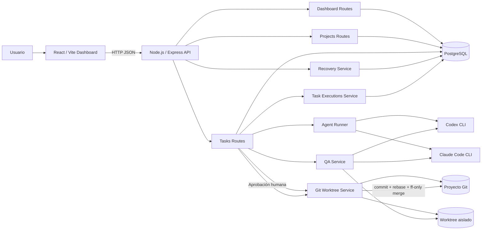

# 01 - Arquitectura de bloques AS-IS

## Responsabilidades

- El frontend opera proyectos, tareas, QA, correcciones, aprobación e historial.
- Express expone `/api/dashboard`, `/api/tasks`, `/api/projects` y health checks.
- PostgreSQL conserva proyectos, agentes, tareas, estados y métricas de ejecuciones.
- Agent Runner abstrae Codex y Claude.
- Cada desarrollo se ejecuta sobre un Git worktree aislado.
- QA valida el resultado antes de permitir aprobación.
- La aprobación humana finaliza el worktree e integra a la rama base.
