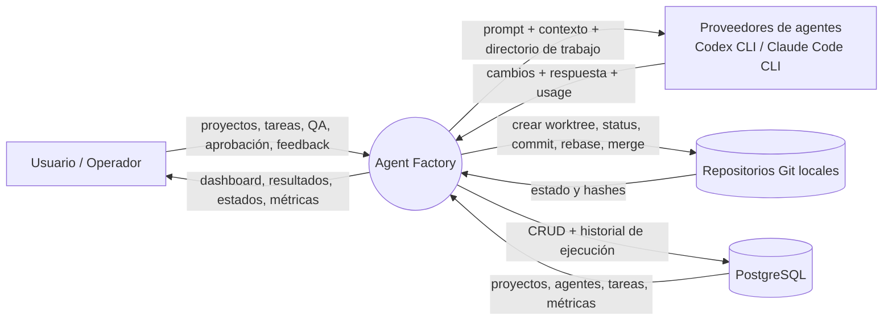

# 02 - DFD Nivel 0 / Contexto

```mermaid
flowchart LR
    U[Usuario / Operador]
    AF((Agent Factory))
    LLM[Proveedores de agentes\nCodex CLI / Claude Code CLI]
    GIT[(Repositorios Git locales)]
    DB[(PostgreSQL)]

    U -->|proyectos, tareas, QA, aprobación, feedback| AF
    AF -->|dashboard, resultados, estados, métricas| U

    AF -->|prompt + contexto + directorio de trabajo| LLM
    LLM -->|cambios + respuesta + usage| AF

    AF -->|crear worktree, status, commit, rebase, merge| GIT
    GIT -->|estado y hashes| AF

    AF -->|CRUD + historial de ejecución| DB
    DB -->|proyectos, agentes, tareas, métricas| AF
```

Este DFD representa el sistema actual antes de incorporar WhatsApp u otros canales externos.
