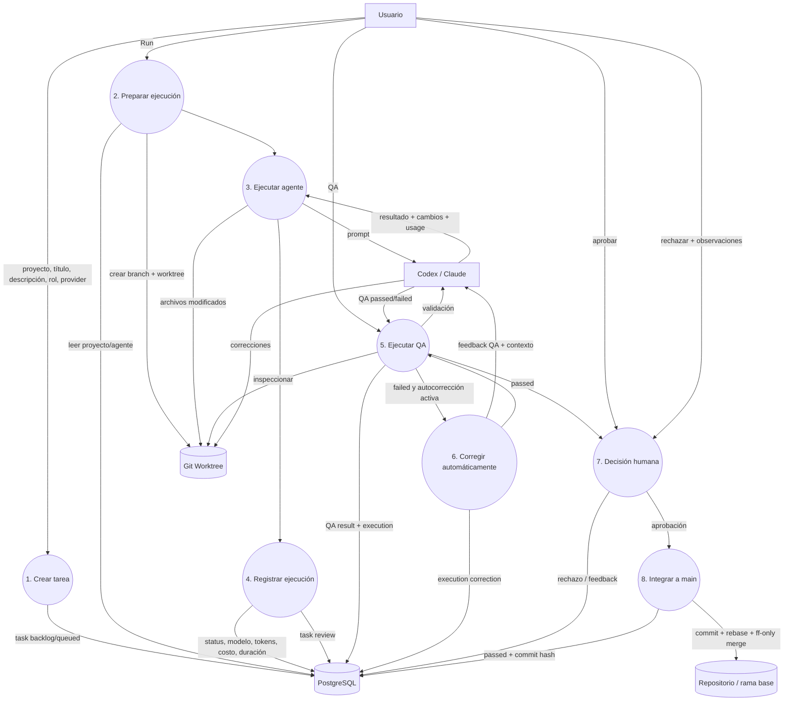

# 03 - DFD Nivel 1 / Procesamiento de tareas

```mermaid
flowchart TD
    U[Usuario]
    P1((1. Crear tarea))
    P2((2. Preparar ejecución))
    P3((3. Ejecutar agente))
    P4((4. Registrar ejecución))
    P5((5. Ejecutar QA))
    P6((6. Corregir automáticamente))
    P7((7. Decisión humana))
    P8((8. Integrar a main))

    DB[(PostgreSQL)]
    WT[(Git Worktree)]
    LLM[Codex / Claude]
    MAIN[(Repositorio / rama base)]

    U -->|proyecto, título, descripción, rol, provider| P1
    P1 -->|task backlog/queued| DB
    U -->|Run| P2
    P2 -->|leer proyecto/agente| DB
    P2 -->|crear branch + worktree| WT
    P2 --> P3
    P3 -->|prompt| LLM
    LLM -->|resultado + cambios + usage| P3
    P3 -->|archivos modificados| WT
    P3 --> P4
    P4 -->|status, modelo, tokens, costo, duración| DB
    P4 -->|task review| DB

    U -->|QA| P5
    P5 -->|inspeccionar| WT
    P5 -->|validación| LLM
    LLM -->|QA passed/failed| P5
    P5 -->|QA result + execution| DB

    P5 -->|failed y autocorrección activa| P6
    P6 -->|feedback QA + contexto| LLM
    LLM -->|correcciones| WT
    P6 -->|execution correction| DB
    P6 --> P5

    P5 -->|passed| P7
    U -->|aprobar| P7
    U -->|rechazar + observaciones| P7
    P7 -->|rechazo / feedback| DB
    P7 -->|aprobación| P8
    P8 -->|commit + rebase + ff-only merge| MAIN
    P8 -->|passed + commit hash| DB
```
