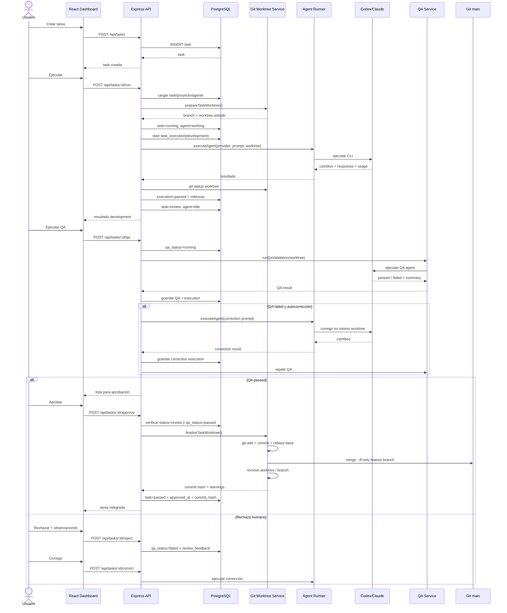

# 04 - Diagrama de secuencia de una Task

```mermaid
sequenceDiagram
    actor U as Usuario
    participant F as React Dashboard
    participant A as Express API
    participant D as PostgreSQL
    participant G as Git Worktree Service
    participant R as Agent Runner
    participant L as Codex/Claude
    participant Q as QA Service
    participant M as Git main

    U->>F: Crear tarea
    F->>A: POST /api/tasks
    A->>D: INSERT task
    D-->>A: task
    A-->>F: task creada

    U->>F: Ejecutar
    F->>A: POST /api/tasks/:id/run
    A->>D: cargar task/proyecto/agente
    A->>G: prepareTaskWorktree()
    G-->>A: branch + worktree aislado
    A->>D: task=running, agent=working
    A->>D: start task_execution(development)
    A->>R: executeAgent(provider, prompt, worktree)
    R->>L: ejecutar CLI
    L-->>R: cambios + respuesta + usage
    R-->>A: resultado
    A->>G: git status worktree
    A->>D: execution=passed + métricas
    A->>D: task=review, agent=idle
    A-->>F: resultado development

    U->>F: Ejecutar QA
    F->>A: POST /api/tasks/:id/qa
    A->>D: qa_status=running
    A->>Q: runQaValidation(worktree)
    Q->>L: ejecutar QA agent
    L-->>Q: passed / failed + summary
    Q-->>A: QA result
    A->>D: guardar QA + execution

    alt QA failed y autocorrección
        A->>R: executeAgent(correction prompt)
        R->>L: corregir en mismo worktree
        L-->>R: cambios
        R-->>A: correction result
        A->>D: guardar correction execution
        A->>Q: repetir QA
    end

    alt QA passed
        A-->>F: lista para aprobación
        U->>F: Aprobar
        F->>A: POST /api/tasks/:id/approve
        A->>D: verificar status=review y qa_status=passed
        A->>G: finalizeTaskWorktree()
        G->>G: git add + commit + rebase base
        G->>M: merge --ff-only feature branch
        G->>G: remove worktree / branch
        G-->>A: commit hash + warnings
        A->>D: task=passed + approved_at + commit_hash
        A-->>F: tarea integrada
    else Rechazo humano
        U->>F: Rechazar + observaciones
        F->>A: POST /api/tasks/:id/reject
        A->>D: qa_status=failed + review_feedback
        U->>F: Corregir
        F->>A: POST /api/tasks/:id/correct
        A->>R: ejecutar corrección
    end
```
