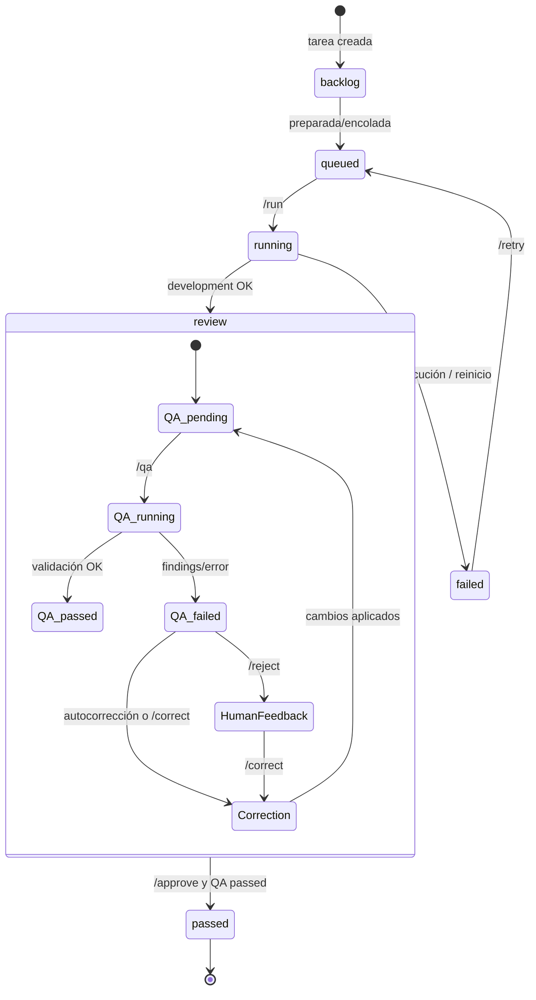

# 05 - Estados de Task y QA

El modelo actual usa dos estados relacionados: `tasks.status` y `tasks.qa_status`.

Estados persistidos de `tasks.status`: `backlog`, `queued`, `running`, `review`, `passed`, `failed`.

QA mantiene su propio ciclo (`pending`, `running`, `passed`, `failed`) y la autocorrección agrega `auto_correction_active`, `auto_correction_stage`, intentos y cantidad de correcciones terminadas.
