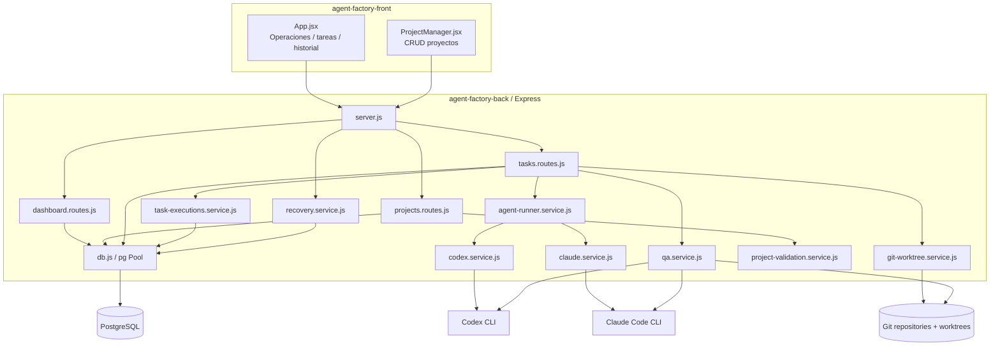

# 06 - Diagrama de componentes

```mermaid
flowchart TB
    subgraph Frontend[agent-factory-front]
        APP[App.jsx\nOperaciones / tareas / historial]
        PM[ProjectManager.jsx\nCRUD proyectos]
    end

    subgraph Backend[agent-factory-back / Express]
        SERVER[server.js]
        DR[dashboard.routes.js]
        TR[tasks.routes.js]
        PR[projects.routes.js]

        AR[agent-runner.service.js]
        CS[codex.service.js]
        CLS[claude.service.js]
        GS[git-worktree.service.js]
        QS[qa.service.js]
        ES[task-executions.service.js]
        RS[recovery.service.js]
        PVS[project-validation.service.js]
        DBM[db.js / pg Pool]
    end

    PG[(PostgreSQL)]
    CODEX[Codex CLI]
    CLAUDE[Claude Code CLI]
    GIT[(Git repositories + worktrees)]

    APP --> SERVER
    PM --> SERVER
    SERVER --> DR
    SERVER --> TR
    SERVER --> PR
    SERVER --> RS

    DR --> DBM
    PR --> DBM
    PR --> PVS
    TR --> DBM
    TR --> AR
    TR --> GS
    TR --> QS
    TR --> ES

    AR --> CS
    AR --> CLS
    CS --> CODEX
    CLS --> CLAUDE
    GS --> GIT
    QS --> GIT
    QS --> CODEX
    QS --> CLAUDE
    ES --> DBM
    RS --> DBM
    DBM --> PG
```
