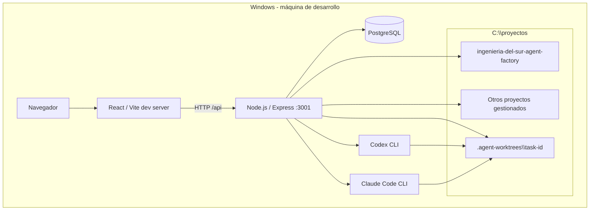

# 07 - Deployment AS-IS

## Restricciones observadas

- El backend limita las rutas operables a `C:/proyectos`.
- Los worktrees se crean bajo `C:/proyectos/.agent-worktrees`.
- El backend usa Node/Express y PostgreSQL; no depende de Docker.
- Codex y Claude se invocan como CLI locales.
- Ante un reinicio del backend, Recovery Service marca ejecuciones/tareas interrumpidas como fallidas y libera agentes en `working`.
