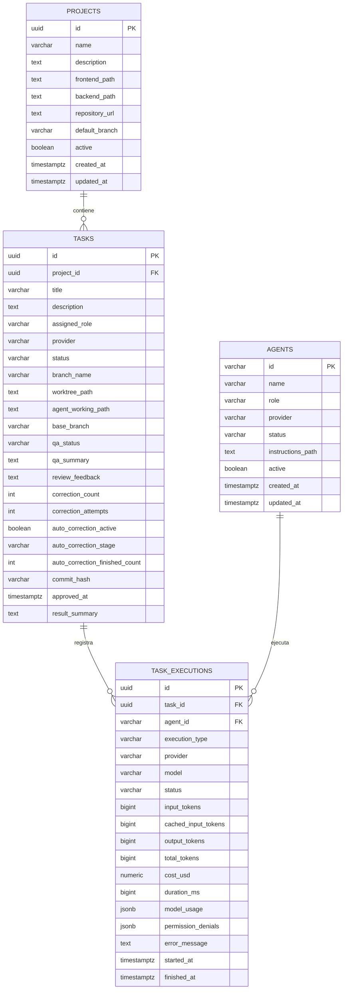

# 08 - Modelo de datos lógico

## Relaciones principales

`projects -> tasks` es 1:N. `tasks -> task_executions` es 1:N y permite conservar development, QA, correcciones y review como ejecuciones separadas. `agents -> task_executions` es 1:N y conserva qué agente produjo cada ejecución incluso cuando una tarea atraviesa varios ciclos.
