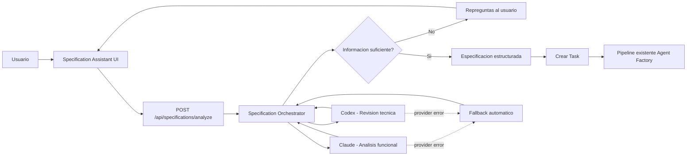

# TO-BE - Specification Assistant

## Regla de fallback

Un error operativo del proveedor (cuota, autenticacion, timeout, CLI o infraestructura) no se interpreta como una decision funcional. El orquestador continua con el proveedor alternativo cuando sea posible y registra el recorrido en `trace`.
