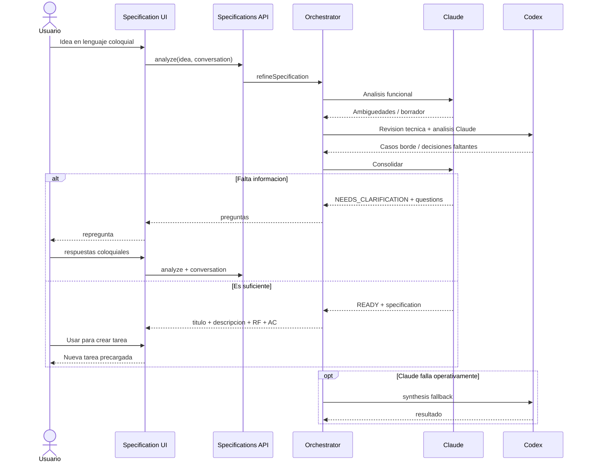

# TO-BE - Secuencia de refinamiento

```mermaid
sequenceDiagram
    actor U as Usuario
    participant UI as Specification UI
    participant API as Specifications API
    participant O as Orchestrator
    participant C as Claude
    participant X as Codex

    U->>UI: Idea en lenguaje coloquial
    UI->>API: analyze(idea, conversation)
    API->>O: refineSpecification
    O->>C: Analisis funcional
    C-->>O: Ambiguedades / borrador
    O->>X: Revision tecnica + analisis Claude
    X-->>O: Casos borde / decisiones faltantes
    O->>C: Consolidar
    alt Falta informacion
        C-->>O: NEEDS_CLARIFICATION + questions
        O-->>UI: preguntas
        UI-->>U: repregunta
        U->>UI: respuestas coloquiales
        UI->>API: analyze + conversation
    else Es suficiente
        C-->>O: READY + specification
        O-->>UI: titulo + descripcion + RF + AC
        U->>UI: Usar para crear tarea
        UI-->>U: Nueva tarea precargada
    end

    opt Claude falla operativamente
        O->>X: synthesis fallback
        X-->>O: resultado
    end
```
