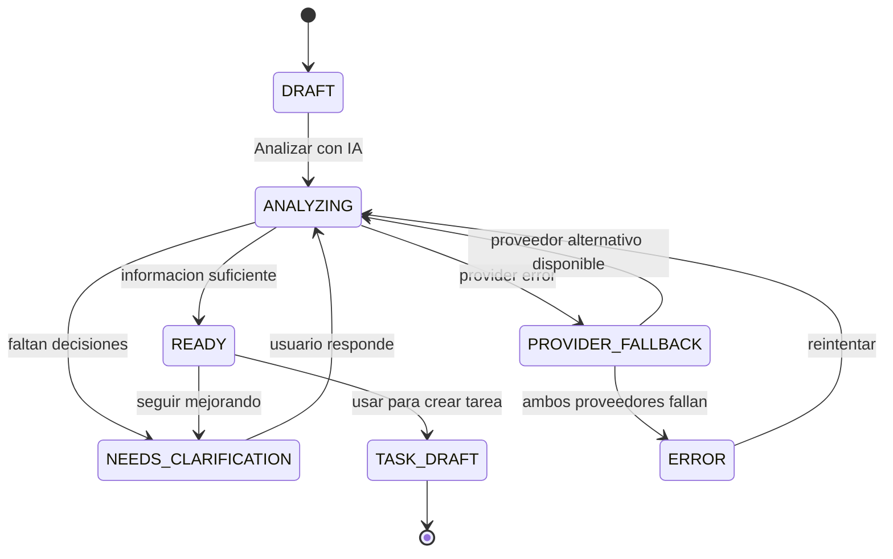

# TO-BE - Estados de Specification Assistant

```mermaid
stateDiagram-v2
    [*] --> DRAFT
    DRAFT --> ANALYZING: Analizar con IA
    ANALYZING --> NEEDS_CLARIFICATION: faltan decisiones
    NEEDS_CLARIFICATION --> ANALYZING: usuario responde
    ANALYZING --> READY: informacion suficiente
    READY --> NEEDS_CLARIFICATION: seguir mejorando
    READY --> TASK_DRAFT: usar para crear tarea
    TASK_DRAFT --> [*]

    ANALYZING --> PROVIDER_FALLBACK: provider error
    PROVIDER_FALLBACK --> ANALYZING: proveedor alternativo disponible
    PROVIDER_FALLBACK --> ERROR: ambos proveedores fallan
    ERROR --> ANALYZING: reintentar
```
